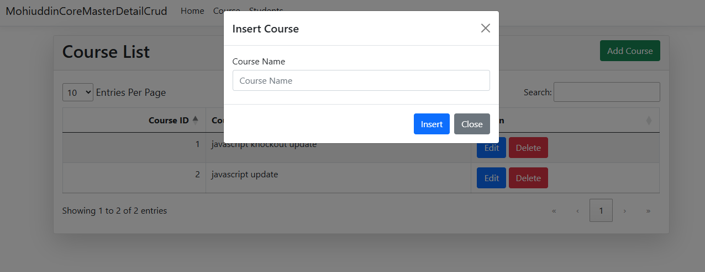
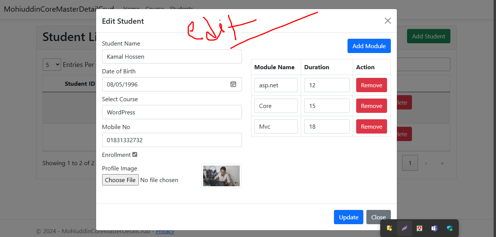
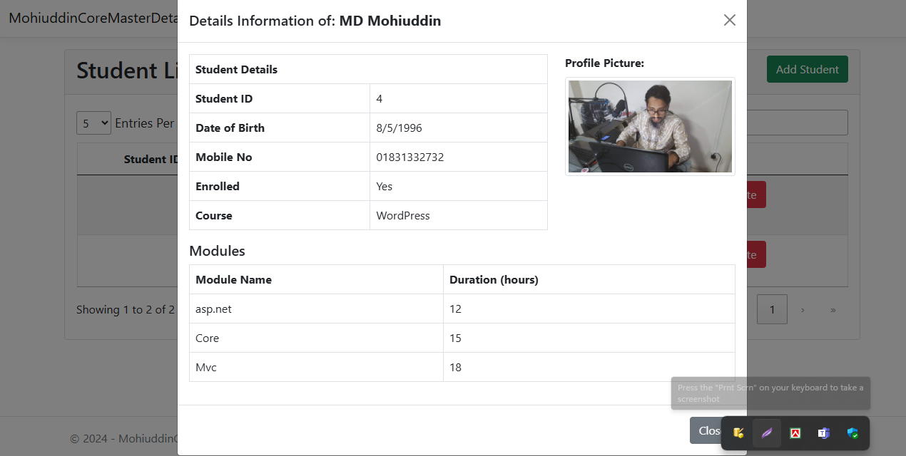

## Master-Details CRUD Application
This project is a Master-Details CRUD application built with ASP.NET Core MVC, Entity Framework Core 8.0.6, and jQuery Ajax. It demonstrates how to perform Create, Read, Update, and Delete operations in a master-details relationship using modern web technologies.

# In this project for Insert and Update Student Data i used Stored Procedure. 

## Features
- ASP.NET Core MVC framework
- Entity Framework Core 8.0.6 for data access
- jQuery and Ajax for asynchronous operations
- Bootstrap for responsive design
- Getting Started
- Prerequisites
- .NET SDK 6.0 or later
- Visual Studio 2022 or later / Visual Studio Code
- SQL Server

## Installation
<strong> Clone the repository:</strong>
- Run this command in Terminal or Gitbash!
 git clone https://github.com/webservice24org/asp.net-master-details-crud

Open the project in Visual Studio:

Open your-repository-name.sln file in Visual Studio.

Restore NuGet packages (If necessary!):

Go to Tools > NuGet Package Manager > Package Manager Console.
Run the following command to restore the packages:
Update-Package -reinstall
Setup the database:

## In the Package Manager Console, run the following commands to apply the migrations and create the database:
- Update-Database
- Running the Application
- Run the application:

Press F5 or click the Start button in Visual Studio to run the application.
The application should open in your default web browser.

# Images View

# Insert Course
 
  
## Insert Master and Details Data

# Edit Master and Details Data

## Details View Master and Details Data

 

## Using the application:

You can now perform CRUD operations on the master-details entities.
The application uses jQuery Ajax to asynchronously handle data operations, providing a smooth user experience.
Project Structure

- Controllers/ - Contains the MVC controllers for handling requests and responses.
- Models/ - Contains the Entity Framework Core models and DbContext.
- Views/ - Contains the Razor views for rendering HTML.
- wwwroot/ - Contains static files like CSS, JavaScript, and images.

# Technologies Used
- ASP.NET Core MVC
- Entity Framework Core 8.0.6
- jQuery and Ajax
- Bootstrap
- Contributing
- Fork the repository.

License
This project is licensed under the MIT License - see the LICENSE file for details.

## About Me
I am Mohiuddin Bhuiyan, In biggening of my career from 2010 I started my journy with SEO but With the last 7 years I am working in web development platform. I am experienced in WordPress Theme Development, Theme Customization using Elementor, PHP Laravel Framework, jQuery, jQuery ajax.

In 2023 I Learned Cross Platform Application Development using ASP.NET, MVC framework, Entity Framework, MSSQL, REST Full API, Web service, JavaScript, jQuery, Ajax. Angular & React and C# ASP.NET MVC/Core in IsDB-BISEW under IT scholarship.

Nowadays I can Develop any type of application using either PHP Laravel framework or Asp.net c#. I’ve completed 100+ web application project using php Laravel, WordPress. I served 3 years at ASHIKA Development Association and 4 years at Tepantor Group, excelling in software development. Currently, as CEO of Microweb Technology Ltd, I lead strategic initiatives and manage development teams. My expertise spans full-stack development, project management, and client relations, driving innovative, high-quality solutions.

- Contact me For your Project
- E-mail: webservice24.org@gmail.com
- WhatsApp: +880 1831332732
- LInkedIn: https://www.linkedin.com/in/worldwebdesk/
